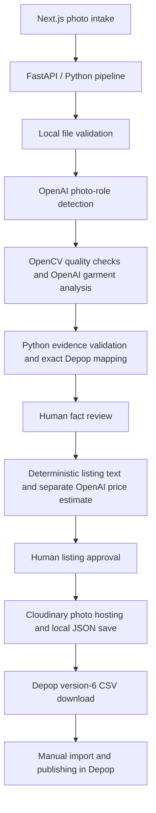

# Relist — Resale Listing Assistant

**Turn clothing photos into a reviewed, photo-ready Depop listing CSV.**

Relist helps secondhand sellers turn a batch of garment and tag photos into
structured listing facts, editable text, and a suggested price. It combines a
Next.js interface with a Python pipeline that validates model output before
anything becomes a listing. After approval, it hosts the photos on Cloudinary
and exports a CSV for manual import into Depop's Selling Hub.

**Stack:** Python · FastAPI · OpenCV · OpenAI Responses API · Next.js · TypeScript · Cloudinary

## Demo

[**Watch the one-minute demo →**](https://github.com/adrithk/Resale-Automator/releases/download/demo-2026-09-03/relist-demo.mp4)

The demo follows photo intake, review, and CSV export. The app runs on localhost;
Depop import and publishing are manual. No credentials or setup are needed to
watch the recording.

## What makes it interesting

- **Evidence-aware extraction.** The vision model proposes facts with confidence
  and photo provenance. Python checks that evidence, blocks unreadable tags,
  and preserves unknowns and conflicts for review.
- **Deterministic marketplace mapping.** Category is resolved before size.
  Versioned vocabularies map fields to exact Depop values, including jeans
  waist/inseam parsing and explicit brand aliases.
- **Separate responsibilities.** Image analysis, fact validation, deterministic
  listing text, and model-assisted pricing are distinct steps. Human edits pass
  validation again before approval.
- **Controlled external calls.** Provider requests use strict Structured Outputs,
  bounded retries, and secret-safe errors. Results record token usage, latency,
  model identifiers, and attempt counts.
- **Repeatable export.** Photo hosting uses content-derived IDs and a local cache.
  CSV downloads reuse hosted photos and the approved price, preserving all three
  leading rows of Depop's version-6 template.

## Workflow

1. Select **3–8 JPEG, PNG, or WebP photos**, including at least two garment views
   and one readable tag. Selection order becomes listing order; the first is the cover.
2. Analyze the photos, then review and edit category, brand, size, condition,
   colors, and optional attributes.
3. Review the generated title, description, and editable **Price (USD)**.
4. Choose **Approve and save locally**. All selected photos, including the tag,
   are hosted on Cloudinary and the approved result is saved as local JSON.
5. Choose **Download Depop CSV**, import it in Depop's Selling Hub, and review
   photos and shipping details before publishing manually.

Example generated text for validated Levi's blue jeans with a 32-inch waist
and 34-inch inseam:

```text
Title: Levi's Blue jeans
Description: Levi's Blue jeans. Size: 32" with a 34" inseam.
```

Condition, style, age, and secondary color remain separate fields in the data
and CSV. Both title and description are editable before approval.

## Architecture



The browser runs on port 3000 and calls the API on port 8000. An unordered batch
uses two hosted requests for classification; web draft generation adds one
pricing request. CSV download makes no new analysis, pricing, or hosting calls.
OpenCV measures resolution, blur, lighting, contrast, and possible glare; the
vision model handles garment understanding.

The configured model is `gpt-5.6-luna`, using the Responses API with strict JSON
schemas, low reasoning effort, high-detail image inputs, and `store=False`.
Requests have a 60-second per-attempt timeout and at most two retries for
transient transport failures. There is no custom model training.

### Where to look in the code

| Area | Entry points | What to inspect |
| --- | --- | --- |
| Web interface | [`web/app/page.tsx`](web/app/page.tsx), [`api.py`](api.py) | Four-stage review flow and thin HTTP adapter |
| Pipeline | [`pipeline_service.py`](pipeline_service.py), [`classifier.py`](classifier.py) | Shared orchestration with separate web and terminal adapters |
| Hosted models | [`openai_vision.py`](openai_vision.py), [`photo_role_detection.py`](photo_role_detection.py), [`listing_pricing.py`](listing_pricing.py) | Schemas, evidence constraints, response parsing, and shared transport |
| Validation | [`contracts.py`](contracts.py), [`fact_validation.py`](fact_validation.py), [`review_validation.py`](review_validation.py), [`depop_vocab.py`](depop_vocab.py) | Provenance, uncertainty, exact mappings, and final human edits |
| Output | [`listing_generation.py`](listing_generation.py), [`photo_hosting.py`](photo_hosting.py), [`local_persistence.py`](local_persistence.py), [`depop_csv.py`](depop_csv.py) | Deterministic text, image preparation/cache, exclusive saves, and template fidelity |
| Tests | [`tests/`](tests/) | Offline provider fixtures, validation edge cases, HTTP behavior, and CSV regression checks |

[FIELD_CONTRACT.md](FIELD_CONTRACT.md) documents field sources, required values,
and export rules. [AGENTS.md](AGENTS.md) records implementation boundaries for
coding agents.

## Run locally

### 1. Install dependencies

Use Python 3.12+ and Node.js 20.9+ with npm. Development currently uses Python
3.14. The web workflow requires an OpenAI API account with access to the
configured model and a Cloudinary account with image upload/create permission.

From the repository root:

```bash
python3 -m venv .venv
source .venv/bin/activate
python -m pip install -r requirements.txt
cd web
npm ci
cd ..
# Keep an existing .env if you already configured one.
[ -f .env ] || cp .env.example .env
```

### 2. Configure the backend

Edit the root `.env`, beside `api.py`:

```dotenv
OPENAI_API_KEY=your_openai_api_key
CLOUDINARY_CLOUD_NAME=your_cloud_name
CLOUDINARY_API_KEY=your_cloudinary_api_key
CLOUDINARY_API_SECRET=your_cloudinary_api_secret
DEPOP_SHIPPING_LOCATION=California, United States
```

Location must exactly match a template value; use a state/country, never a street
address. Credentials stay in the backend. The API loads `.env` at startup;
existing shell variables take precedence. Restart it after configuration changes.

Optional `RESALE_OPENAI_SERVICE_TIER` defaults to `auto` (provider defaults).
`default` requests standard processing; `fast` or `priority` opts into premium
Priority processing. This changes only the requested service tier, not the model,
images, or validation. No measured speedup is claimed.

### 3. Start the app

Backend, from the repository root:

```bash
source .venv/bin/activate
uvicorn api:app --reload --host 127.0.0.1 --port 8000
```

Frontend, in a second terminal:

```bash
cd web
npm run dev
```

Open [localhost:3000](http://localhost:3000). Interactive API documentation is at
[localhost:8000/docs](http://localhost:8000/docs). Keep both terminals running;
this unauthenticated demo is intended for local use only.

### Command-line option

The CLI supports analysis and terminal review. Pricing, photo hosting, and CSV
download belong to the web workflow. Make `OPENAI_API_KEY` available in the
terminal environment, then run:

```bash
python classifier.py --item path/to/front.jpg --item path/to/back.jpg --tag path/to/tag.jpg --review
# Or an unordered, non-recursive folder:
python classifier.py --photo-folder path/to/clothing-photos --review
```

## Verification

Run the offline suite and production frontend build without provider credentials:

```bash
RESALE_RUN_LIVE_SMOKE=0 RESALE_RUN_CLOUDINARY_SMOKE=0 .venv/bin/python -m unittest discover -s tests -v
cd web
npm run build
```

Tests exercise strict provider schemas and mocked transport, readable-tag gates,
provenance and conflicts, category-dependent sizes, human corrections, pricing,
image formats and metadata removal, upload caching, local persistence, and exact
CSV/HTTP output. Offline tests establish behavior under those fixtures; they do
not measure live model accuracy or latency.

Three live tests are skipped by default. They require explicit opt-in and may
incur costs: [`test_live_smoke.py`](tests/test_live_smoke.py) makes two OpenAI
requests with user-supplied photos when `RESALE_RUN_LIVE_SMOKE=1`;
[`test_cloudinary_smoke.py`](tests/test_cloudinary_smoke.py) uploads, verifies, and
removes three synthetic images when `RESALE_RUN_CLOUDINARY_SMOKE=1`.

## Scope and tradeoffs

- **Local app, hosted processing.** Analysis photos go to OpenAI; approved listing
  photos go to Cloudinary. Public photo copies have EXIF/GPS metadata removed,
  but anyone with their URLs can view them. Keep them hosted until import completes.
- **Review remains essential.** A readable tag is required. Prices are model
  suggestions, not researched Depop averages: Python halves the estimated resale
  value and rounds half-up to cents, usually targeting $10–$15 for ordinary items
  without a hard clamp.
- **Bounded photo support.** Files are limited to 10 MB each. Genuine phone JPEGs,
  including MPO auxiliary-image variants, are supported. Hosting prepares
  orientation-correct, metadata-free JPEGs without resizing, with a 40 MP limit.
  HEIC is not supported; export it as JPEG instead of renaming it.
- **Deliberately limited infrastructure.** No database, authentication, public
  deployment, or automatic publishing. API usage and hosting may incur charges.
  `.env`, local uploads, caches, and approved listing JSON are ignored by Git.
- **Marketplace integration stops at CSV.** Selling API access is not available
  to this project; autonomous selling remains pending approved access. No
  application or approval is claimed. The earlier browser automation experiment
  was removed; manual import is the supported workflow.

This is an independent project, not affiliated with Depop. The interface uses
locally bundled Montserrat under its [SIL Open Font License](web/app/fonts/OFL.txt).

## Troubleshooting

| Symptom | Check |
| --- | --- |
| Missing API credentials | Edit root `.env` and restart FastAPI. Shell values take precedence; never place secrets in the frontend. |
| Cloudinary denies uploads | Check image-create permission and credentials, then restart the backend. |
| Old saved listing has no photos | Create and approve a new listing; image-less JSON cannot make the current CSV export. |
| Depop reports a template mismatch | Compare its template with the version-6 fixture. Preserve the first three rows. |
| Phone photo is rejected | Export a real JPEG, PNG, or WebP under 10 MB; changing a HEIC filename is insufficient. |
| npm certificate error on macOS | Configure a trusted CA bundle; do not disable TLS verification. |
